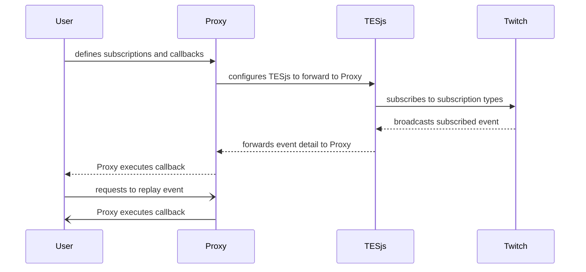

# Twitch Event Proxy

```mermaid
sequenceDiagram
    participant U as User
    participant P as Proxy
    participant TE as TESjs
    participant TW as Twitch

    U->>P: defines subscriptions and callbacks
    P->>TE: configures TESjs to forward to Proxy
    TE->>TW: subscribes to subscription types

    TW-->>TE: broadcasts subscribed event
    TE-->>P: forwards event detail to Proxy
    P-->>U: Proxy executes callback

    U-)P: requests to replay event
    P-)U: Proxy executes callback
```
