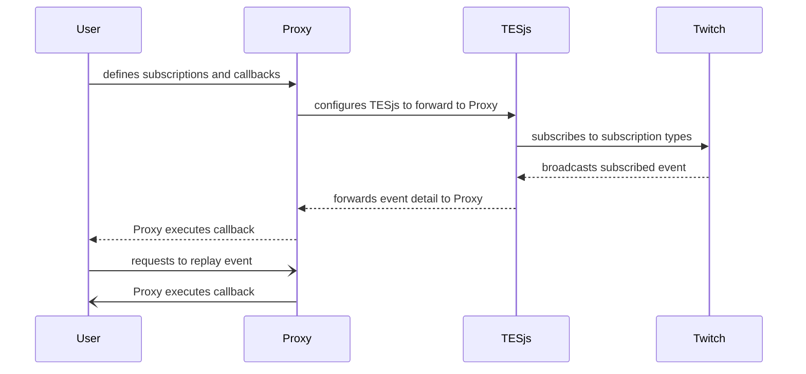

# Twitch Event Proxy

A websocket proxy and basic echo server that stores the content of the message to allow replaying of it later.



## TESjs

TESjs really helped in simplifying communication with Twitch eventsub. Check out their project [here](https://github.com/mitchwadair/tesjs).

With TESjs behind it, I implemented a simple abstraction for defining subscriptions with their conditions and callbacks:

```js
const subscription_callbacks = {
    "channel.update": {
        conditions: {
            broadcaster_user_id: CONFIG.broadcaster_user_id
        },
        callback: (data) => {
            console.log(data);
        }
    },
    ...
}
setupProxy(CONFIG, subscription_callbacks);
```

And that's really all you'd need in your overlay document.

## Run locally

Replace config with your own and give it a go.

Run locally with your preferred container engine (I suggest podman if you don't have one). SQLite store persists to `data/events.db`.

```txt
$ podman-compose up --build app
...
INFO - kemal: [development] Kemal is ready to lead at http://0.0.0.0:3000
```

The example includes gui at `/gui`, and socket at `/socket`. Static content served from `./public`.

## Example

A small example of showing a twitch notification on channel title change (source in `public/`).


